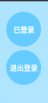
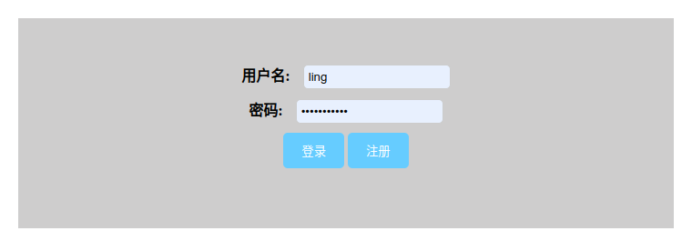

# 服务端配置

[演示网页]([https://ling2023.xyz/]())

## cpython运行方法及依赖：

```sh
sudo apt-get update
sudo apt-get install nginx -y
sudo apt-get install python3 -y
sudo apt-get install python3-pip -y
```

```sh
pip install gunicorn
pip install flask
pip install flask_cors
```

*注：在gunicorn中 -w是进程数，t是超时时间，b是绑定ip和端口，app是app名称（app不需要写扩展名）*

### http访问

```sh
gunicorn -w 4 -t 30 -b 0.0.0.0:3920 ling_blog_background:app
```

### https访问(需要域名及ssl证书，选择nginx那个下载就行)

```sh
gunicorn -w 4 -t 30 -b 0.0.0.0:3920 --certfile=/var/www/html/ling-root/ling-ssl/ling2023.xyz.pem --keyfile=/var/www/html/ling-root/ling-ssl/ling2023.xyz.key  ling_blog_background:app
```

### http访问(后台运行)

```sh
nohup gunicorn -w 4 -t 30 -b 0.0.0.0:3920 ling_blog_background:app > nohup.out & disown
```

### https访问(需要域名及ssl证书，选择nginx那个下载就行)(后台运行)

```sh
nohup gunicorn -w 4 -t 30 -b 0.0.0.0:3920 --certfile=/var/www/html/ling-root/ling-ssl/ling2023.xyz.pem --keyfile=/var/www/html/ling-root/ling-ssl/ling2023.xyz.key  ling_blog_background:app > nohup.out & disown
```

## pypy3运行方法及依赖(性能更好)：

```sh
sudo apt-get install nginx -y
sudo apt-get install pypy3 -y
sudo apt-get install python3-dev libpq-dev -y
sudo apt-get install pypy3-dev libpq-dev -y
sudo apt-get install libpq-dev postgresql-server-dev-all -y
```

```sh
pypy3 -m pip install psycopg2
pypy3 -m pip install flask
pypy3 -m pip install flask_cors
pypy3 -m pip install Flask-CORS
pypy3 -m pip install gunicorn
```

### http访问

```sh
pypy3 -m gunicorn -w 4 -t 30 -b 0.0.0.0:3920 ling_blog_background:app
```

### https访问(需要域名及ssl证书，选择nginx那个下载就行)

```sh
pypy3 -m gunicorn -w 4 -t 30 -b 0.0.0.0:3920 --certfile=/var/www/html/ling-root/ling-ssl/ling2023.xyz.pem --keyfile=/var/www/html/ling-root/ling-ssl/ling2023.xyz.key  ling_blog_background:app
```

### http访问(后台运行)

```sh
nohup pypy3 -m gunicorn -w 4 -t 30 -b 0.0.0.0:3920 ling_blog_background:app > nohup.out & disown
```

### https访问(需要域名及ssl证书，选择nginx那个下载就行)(后台运行)

```sh
nohup pypy3 -m gunicorn -w 4 -t 30 -b 0.0.0.0:3920 --certfile=/var/www/html/ling-root/ling-ssl/ling2023.xyz.pem --keyfile=/var/www/html/ling-root/ling-ssl/ling2023.xyz.key  ling_blog_background:app > nohup.out & disown
```

# 客户端配置




## web.html使用方法

直接将其中的css和js以及html文件复制到你的html中即可

### html部分

```html
<button id="login_text" class="login-button" onclick="window.location.href='login/login.html'"></button>
<button class="login-button1" id="exit" onclick="exit()">退出登录</button>
```

###css部分，放到你的html中用 `<style></style>`包起来

```css
.login-button {
    position: fixed;
    top: 15px;
    right: 15px;
    background-color: #66ccff;
    border: none;
    color: rgb(255, 255, 255);
    text-align: center;
    text-decoration: none;
    display: inline-block;
    font-size: 10px;
    cursor: pointer;
    font-weight: bold;
    border-radius: 50%;
    width: 50px;
    height: 50px;
        }
.login-button1 {
    position: fixed;
    top: 70px;
    right: 15px;
    background-color: #66ccff;
    border: none;
    color: rgb(255, 255, 255);
    text-align: center;
    text-decoration: none;
    display: inline-block;
    font-size: 10px;
    cursor: pointer;
    font-weight: bold;
    border-radius: 50%;
    width: 50px;
    height: 50px;
}
```

###js部分，放到你的html中

```javascript
<script>
      document.getElementById('login_text').innerText = '已登录';
      document.getElementById('login_text').innerText = '未登录，点击登录';
      function exit(){
        localStorage.removeItem("zhanghao");
        localStorage.removeItem("mima");
        document.getElementById('exit').innerText = '已退出';
        location.reload();
      }

      document.addEventListener('DOMContentLoaded', function() {
      var user_name = localStorage.getItem("zhanghao");
      var user_password = localStorage.getItem("mima");
      const data = { 'username': user_name, 'password': user_password }; 
      fetch('https://ling2023.xyz:3920/verify', {
          method: 'POST',
          headers: {
              'Content-Type': 'application/json'
          },
          body: JSON.stringify(data)
      })
      .then(response => response.json()) // 解析响应体为JSON
      .then(data => {
          console.log(data);
          if (data.success) { // 检查'success'字段
              document.getElementById('login_text').innerText = '已登录';
          } else {
              document.getElementById('login_text').innerText = '未登录，点击登录';
          }
      })
      .catch(error => console.error('Error:', error));
  });
  

</script>
```

## login.html使用方法

### 直接在你的项目中创建一个login文件夹将login.html复制进取

***login.html:***

```html
<!DOCTYPE html>
<html lang="en">
<head>
    <meta charset="UTF-8">
    <meta name="viewport" content="width=device-width, initial-scale=1.0">
    <title>登录</title>
    <style>
        #response-message {
            position: fixed;
            left: 50%;
            transform: translateX(-50%);
            background-color: #ccd7d8;
            padding: 10px;
            border: 1px solid #dadb96;
            border-radius: 5px;
        }


        label {
            font-weight: bold;
            margin-right: 10px;
        }

        input[type="text"], input[type="password"] {
            padding: 5px;
            border: 1px solid #ccc;
            border-radius: 5px;
            width: 150px;
            margin-bottom: 10px;
        }

        button {
            padding: 10px 20px;
            background-color: #66ccff;
            color: white;
            border: none;
            border-radius: 5px;
            cursor: pointer;
        }


        .nav-item {
            display: flex;
            flex-direction: column;
            align-items: center;
            text-decoration: none;
            color: #666;
        }

        .nav-item.active {
            color: #00a0e9;
        }

        .nav-item img {
            width: 24px;
            height: 24px;
            margin-bottom: 4px;
        }

        .button {
            background-color: #7c7d80;
            color: #ffffff;
            padding: 10px 20px;
            border: none;
            margin: 10px;
            cursor: pointer;
            text-decoration: none;
            border-radius: 15px;
        }


        .center-container {
            text-align: center;
            margin-top: 10%;
            background-color: #cecdcd; /* 设置背景颜色 */
            padding: 50px;
            margin-left: 20%; /* 设置左边距 */
            margin-right: 20%;
        }
    </style>
</head>
<body>
    <script>

        var user_login_information
        var user_login
        var zhanghao
        var mimas
        document.addEventListener("DOMContentLoaded", function() {
            var cunchumima = localStorage.getItem("mima");
            var cunchuzhanghao = localStorage.getItem("zhanghao");
            var changdu
            changdu = cunchumima.length
            if (changdu>=5) {
                tongguo = cunchuzhanghao+','+cunchumima
                window.location.replace("../../web.html");
            }else{
                console.log('登录去吧你！！！')
            }
        });


        function username() {
            localStorage.removeItem("mima");
            localStorage.removeItem("zhanghao");
            localStorage.removeItem("responseMessage"); 
            var text = document.getElementById("text-input").value;
            var password = document.getElementById("text-input-password").value;
            zhanghao = text
            mima = password
            text = text+","+password
            var xhr = new XMLHttpRequest();
            xhr.open("POST", "http://192.168.1.6:3920/denglu", true);
            xhr.setRequestHeader("Content-Type", "application/x-www-form-urlencoded");
            xhr.onreadystatechange = function() {
                if (xhr.readyState === 4 && xhr.status === 200) {
                    user_login_information=xhr.responseText;

                    function decodeUnicode(str) {
                    return str.replace(/\\u[\dA-F]{4}/gi, function(match) {
                        return String.fromCharCode(parseInt(match.replace(/\\u/g, ''), 16));
                        console.log("123");
                    });
                    }
                    user_login = decodeUnicode(user_login_information);
                    if(user_login_information=="登录失败"){
                        console.log("请检查用户名密码")
                        document.getElementById("denglushibai").textContent = "登录失败，请检查用户名及密码！";
                    }
                    user_login =JSON.parse(user_login);
                    user_login = user_login.message;
                    console.log(user_login);
                    localStorage.setItem("zhanghao", zhanghao);
                    localStorage.setItem("mima", mima);
                    var user_status = localStorage.getItem('user_status');
                    console.log(user_status);
                    window.location.assign(user_status);
                }
            };
            xhr.send("text=" + text);
        }

    </script>


    <div class="center-container">
        <center>
            <td><label>用户名:</label></td>
            <td><input type="text" name="username" id="text-input" placeholder="请输入3-10位用户名"></td>
            <br/>
            <td><label>密码:</label></td>
            <td><input type="password" id="text-input-password" placeholder="请输入5-20位密码"></td>
            <br/>
            <button onclick="username();">登录</button>
            <button onclick="window.location.href='signup.html'">注册</button>
            <p id="denglushibai"></p>
        </center>
    </div>


</body>
</html>
```

## signup.html使用方法

### 将signup.html复制到你刚创建的login文件夹内

***singup.html:***

```html
<!DOCTYPE html>
<html lang="en">
<head>
    <meta charset="UTF-8">
    <meta name="viewport" content="width=device-width, initial-scale=1.0">
    <title>注册</title>
    <style>
        #response-message {
            position: fixed;
            left: 50%;
            transform: translateX(-50%);
            background-color: #ccd7d8;
            padding: 10px;
            border: 1px solid #dadb96;
            border-radius: 5px;
        }


        label {
            font-weight: bold;
            margin-right: 10px;
        }

        input[type="text"], input[type="password"] {
            padding: 5px;
            border: 1px solid #ccc;
            border-radius: 5px;
            width: 150px;
            margin-bottom: 10px;
        }

        button {
            padding: 10px 20px;
            background-color: #66CCFF;
            color: white;
            border: none;
            border-radius: 5px;
            cursor: pointer;
        }


        .nav-item {
            display: flex;
            flex-direction: column;
            align-items: center;
            text-decoration: none;
            color: #666;
        }

        .nav-item.active {
            color: #00a0e9;
        }

        .nav-item img {
            width: 24px;
            height: 24px;
            margin-bottom: 4px;
        }
        .button {
            background-color: #7c7d80;
            color: #66ccff;
            padding: 10px 20px;
            border: none;
            margin: 10px;
            cursor: pointer;
            text-decoration: none;
            border-radius: 15px;
        }


        .center-container {
            text-align: center;
            margin-top: 10%;
            background-color: #cecdcd; 
            padding: 50px;
            margin-left: 20%;
            margin-right: 20%;
        }
    </style>
</head>
<body>
    <div class="center-container ">
        <center>
            <td><label>用户名:</label></td>
            <td><input type="text" name="username" id="text-input" placeholder="请输入3-10位用户名"></td>
            <br/>
            <td><label>密码:</label></td>
            <td><input type="password" id="text-input-password" placeholder="请输入5-20位密码"></td>
            <br/>
            <button onclick="sendText(event);">确定</button>
            <button onclick="window.location.href='login.html'">去登录</button>
            <br/>
        </center>
    </div>

    <div id="response-message"></div>
    <script>  

        window.onload = function() {
            var storedMessage = localStorage.getItem("responseMessage");
            if (storedMessage) {
                var responseMessage = document.getElementById("response-message");
                responseMessage.innerText = storedMessage;
                localStorage.removeItem("responseMessage");
            }
        }

        function sendText(event) {
            event.preventDefault();
            var text = document.getElementById("text-input").value;
            var password = document.getElementById("text-input-password").value;
            text = text + "," + password;
            var xhr = new XMLHttpRequest();
            xhr.open("POST", "http://192.168.1.6:3920/send-text", true);
            xhr.setRequestHeader("Content-Type", "application/x-www-form-urlencoded");
            xhr.onreadystatechange = function() {
                if (xhr.readyState === 4 && xhr.status === 200) {
                    console.log(xhr.responseText);
                    var response = JSON.parse(xhr.responseText);
                    var responseMessage = document.getElementById("response-message");
                    responseMessage.innerText = response.message;

                    localStorage.setItem("responseMessage", response.message);
                }
            };
            xhr.send("text=" + text);
        }
    </script>
</body>
</html>
```
